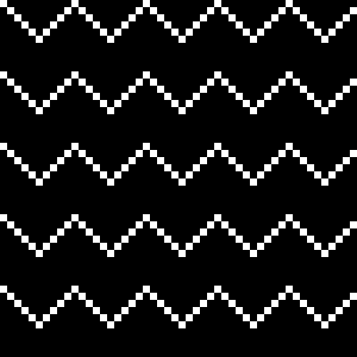

# Go's Game of Liberty

[](https://pkg.go.dev/github.com/DumDumGeniuss/ggol)
[](https://goreportcard.com/report/github.com/DumDumGeniuss/ggol)
[](https://github.com/DumDumGeniuss/ggol/actions/workflows/go.yml)

Go's Game of Liberty is a go package that provides a set of API for you to build a game in 2d map, this API was initially for helping you build the [Conway's Game of Life](https://en.wikipedia.org/wiki/Conway%27s_Game_of_Life), but later we found more possibilities of it, so the Go's Game of Liberty came out.

Looking forward to seeing your masterpiece built with the API :).

For more details, please check [API document](https://pkg.go.dev/github.com/DumDumGeniuss/ggol) here.

## Features

* Easy to setup.
* Concurrently safe.
* Fully customizable.

## Install

```bash
go get github.com/DumDumGeniuss/ggol
```

## Usage

### Build Conway's Game of Life

The example below shows you how to buil a the Conway's Game of Life with the API.

```go
package main

import (
    "fmt"

    "github.com/DumDumGeniuss/ggol"
)

// Define your area type, in standard Conway's
// Game of Life, an area can have a live cell at most,
// so we need the field "HasLiveCell" here.
type CgolArea struct {
    HasLiveCell bool
}

// This is the core part of the game, it tells the game
// how to generate the next status of the given area.
// This generator here implements 4 basic rules of Conways Game
// of Life, if you want, you can add your custom rules here :).
func cgolNextAreaGenerator(
    // Coordinate of the given area.
    coord *ggol.Coordinate,
    // Pointer to the current area status.
    area *CgolArea,
    // A getter for getting adjacent areas, check this type ggol.AdjacentAreaGetter[T] for details.
    getAdjacentArea ggol.AdjacentAreaGetter[CgolArea],
) (nextCgolArea *CgolArea) {
    newArea := *area

    // Get live adjacent cells count
    // We need to to implement 4 basic rules of
    // Conways Game of Life.
    var liveAdjacentCellsCount int = 0
    for i := -1; i < 2; i += 1 {
        for j := -1; j < 2; j += 1 {
            if !(i == 0 && j == 0) {
                // Pay attention to "isCrossBorder", if the adjacent area in relative coordinate
                // is on other side of the field, "isCrossBorder" will be true.
                // So if you want to allow your cells to cross border, ignore "isCrossBorder".
                adjArea, isCrossBorder := getAdjacentArea(coord, &ggol.Coordinate{X: i, Y: j})
                if adjArea.HasLiveCell && !isCrossBorder {
                    liveAdjacentCellsCount += 1
                }
            }
        }
    }
    if newArea.HasLiveCell {
        if liveAdjacentCellsCount == 2 || liveAdjacentCellsCount == 3 {
            // Cell survives due to rule 2.
            newArea.HasLiveCell = true
            return &newArea
        } else {
            // Died of rule 1 or rule 3.
            newArea.HasLiveCell = false
            return &newArea
        }
    } else {
        // Cell becomes alive due to rule 4.
        if liveAdjacentCellsCount == 3 {
            newArea.HasLiveCell = true
            return &newArea
        }
        return &newArea
    }
}

func main() {
    // Declare field size.
    fieldSize := ggol.FieldSize{Height: 3, Width: 3}
    // Initial status of all areas.
    initialCgolArea := CgolArea{HasLiveCell: false}

    // Alrighty, let's create a new game with field size of 3x3,
    // you also need to tell the game what's the initial status
    // of each area, let's assume all areas are without any live cells at beginning.
    // At the end, you need to pass in your custom iterator you just declared above.
    game, _ := ggol.NewGame(
        &fieldSize,
        &initialCgolArea,
    )
    // Set area iterator.
    game.SetNextAreaGenerator(cgolNextAreaGenerator)

    // Let's revice 3 cells to form a Blinker pattern :).
    // What is Blinker? https://conwaylife.com/wiki/Blinker
    game.SetArea(&ggol.Coordinate{X: 1, Y: 0}, &CgolArea{HasLiveCell: true})
    game.SetArea(&ggol.Coordinate{X: 1, Y: 1}, &CgolArea{HasLiveCell: true})
    game.SetArea(&ggol.Coordinate{X: 1, Y: 2}, &CgolArea{HasLiveCell: true})

    // This will generate next field, the next field is depending on "cgolNextAreaGenerator"
    // you just passed in "SetNextAreaGenerator" above.
    game.GenerateNextField()

    // Let's see if we generate the next status of the Blinker correctly.
    // If it's correct, all areas below should have "HasLiveCell" as true.
    for x := 0; x < fieldSize.Width; x += 1 {
        area, _ := game.GetArea(&ggol.Coordinate{X: x, Y: 1})
        fmt.Printf("%v ", area.HasLiveCell)
    }
    // true true true
}
```

### Conway's Game of Life

[Sample Code](./example/conways_game_of_life.go)


### Game of Wave

Build multiple wave that keep going up forever.

[Sample Code](./example/game_of_wave.go)



### Game of Black and White

You can switch black and white in every iteration.

[Sample Code](./example/game_of_black_and_white.go)


### Game of King

When cells collide, they get more power, cells with greatest power will show in gold color.

[Sample Code](./example/game_of_king.go)


### Game of Matrix

The rain of code in the movie Matrix.

[Sample Code](./example/game_of_matrix.go)


## Development

We use Makefile to setup develop environments.

### Run Unit Tests

```bash
make test
```

### Setup Pre-commit Hook

```bash
make setup-pre-commit
```

### Build Sample GIFs As Demo

You can refer to sample code in [here](./example/) to build GIFs of your custom games.

```bash
make demo
```

## License

[MIT License](./LICENSE)
