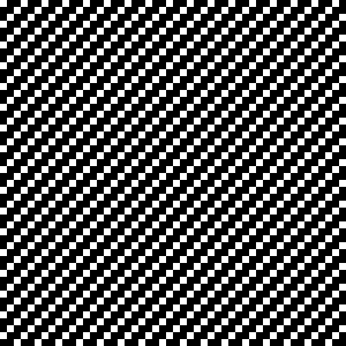

# Gonways Game of Life

[](https://pkg.go.dev/github.com/DumDumGeniuss/ggol)
[](https://goreportcard.com/report/github.com/DumDumGeniuss/ggol)
[](https://app.travis-ci.com/DumDumGeniuss/ggol)

Gonways Game of Life is a go package that provides fundamental functions for running [Conway's Game of Life](https://en.wikipedia.org/wiki/Conway%27s_Game_of_Life),

The goal is to help you build a Conway's Game of Life in the way you like.

## Install This Package

```bash
go get github.com/DumDumGeniuss/ggol
```

## Initialize A New Game

```go
package main

import {
    "fmt"
    
    "github.com/DumDumGeniuss/ggol"
)

type MyArea struct {
    HasLiveCell bool
}

func areaIterator (
    coord *ggol.Coordinate,
    area *MyArea,
    getAdjacentArea ggol.GetAdjacentArea[MyArea],
) *MyArea {
    newArea := *area

    var aliveAdjacentCellsCount int = 0
    for i := -1; i < 2; i += 1 {
        for j := -1; j < 2; j += 1 {
            if !(i == 0 && j == 0) {
                adjArea, isCrossBorder := getAdjacentArea(coord, &Coordinate{X: i, Y: j})
                if adjArea.HasLiveCell && !isCrossBorder {
                    aliveAdjacentCellsCount += 1
                }
            }
        }
    }
    if newArea.HasLiveCell {
        if aliveAdjacentCellsCount != 2 && aliveAdjacentCellsCount != 3 {
            newArea.HasLiveCell = false
            return &newArea
        } else {
            newArea.HasLiveCell = true
            return &newArea
        }
    } else {
        if aliveAdjacentCellsCount == 3 {
            newArea.HasLiveCell = true
            return &newArea
        } else {
            newArea.HasLiveCell = false
            return &newArea
        }
    }
}

main() {
    game, _ := ggol.New(
        &ggol.Size{Height: 3, Width: 3},
        &MyArea{HasLiveCell: false},
        areaIterator,
    )

    game.SetArea(&ggol.Coordinate{X: 1, Y: 0}, MyArea{HasLiveCell: true})
    game.SetArea(&ggol.Coordinate{X: 1, Y: 1}, MyArea{HasLiveCell: true})
    game.SetArea(&ggol.Coordinate{X: 1, Y: 2}, MyArea{HasLiveCell: true})

    game.Iterate()

    fmt.Println(game.GetArea(&ggol.Coordinate{X: 0, Y: 1}))
}
```

## What You Can Build?

You can build this


And this



And this


And for sure, classic game


## Build GIF

```bash
git clone https://github.com/DumDumGeniuss/ggol.git
cd ggol
go mod tidy
go run ./cmd/*
```

## Document

### New

Create a new Conway's Game of Life for you with your custom initial area and your custom way of iterating areas.

### Reset

Reset entire generation with intial area.

### Iterate

Iterate generation to get next generation.

### SetArea

Set value of the area at the coordinate.

### GetSize

Get size of the game.

### GetArea

Get area at the coordinate.

### GetField

Get current genertaion.
